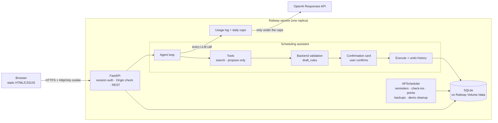

# Schreduler

**계획을 기록하는 데서 끝나지 않고 지키게 도와주는 일정 관리 앱 — 하고 싶은 걸 말로 하면 AI 어시스턴트가 변경안을 만들고, 확인한 뒤에만 저장합니다.**

> 🚧 **초기 프로토타입입니다.** 앞으로 더 크게 개발할 일정 관리 앱의 프로토타입이며, 아직 완성되지 않은 기능이 있고 바뀔 수 있습니다.

**라이브 데모: <https://schreduler.up.railway.app>** — 로그인 화면에서 **Try the demo(데모 체험하기)** 를 누르세요. 가입 없이 예시 대학생 일주일이 들어 있는 임시 계정으로 들어가며, 24시간 뒤 삭제됩니다.


English: [README.md](README.md) · 설계 문서: [기획보고서](docs/기획보고서.md) · [어시스턴트 설계·평가](docs/assistant_design.md) · [API 안내](docs/api_overview.md)

## 엔지니어링 하이라이트

**슬롯필링에서 도구 기반 에이전트로.** 첫 버전은 LLM 출력으로 정해진 슬롯을 채우고 빈 곳을 손으로 짠 규칙으로 메웠습니다(`event_parse_service`, 1,093줄). "2주마다" 무시, 장소 수정 불가, "11:00-1:00"을 오전 11시~새벽 1시로 읽는 버그가 모두 슬롯을 하나씩 덧붙이는 구조에서 나왔습니다. 지금은 LLM이 **제안만** 합니다: 도구는 검색과 초안 작성만 하고 DB에 쓰지 않으며, 백엔드가 모든 초안을 같은 순수 규칙 모듈(`draft_rules.py`)로 검증·정규화하고, 사용자가 카드를 확인하며(모델이 같은 턴에 만든 제안을 스스로 승인할 수 없음), 실행된 변경은 모두 기록돼 되돌릴 수 있습니다. 옛 경로를 지우면서 LLM 클라이언트가 1,281줄에서 644줄로 줄었습니다.

**평가 세트로 모델과 추론 강도 고르기.** 감으로 정하지 않고, 실제로 실패했던 요청들로 평가 세트(`tests/assistant_eval/cases.yaml`)를 만들어 실제 API로 돌렸습니다. 기준은 전체 90% 이상, 틀리면 가장 아픈 범주(격주, 오전/오후, 마감, 확인 안전)는 100%, 그중 턴당 비용이 가장 낮은 조합입니다. 1차(30건, 조합당 1회):

| 모델 | 추론 강도 | 통과 | 기준 충족 | 1,000턴당 비용 | 평균 지연 |
|---|---|---|---|---|---|
| **gpt-5.6-luna** | **medium** | **29/30 (97%)** | **예** | **$0.62** | 3.8초 |
| gpt-5.6-luna | low | 28/30 (93%) | 아니오 (오전오후 4/5) | $0.55 | 3.5초 |
| gpt-5.4-nano | low | 27/30 (90%) | 예 | $0.88 | 3.0초 |
| gpt-5.4-nano | medium | 29/30 (97%) | 예 | $1.10 | 4.0초 |
| gpt-5.4-mini | low | 26/30 (87%) | 아니오 | $2.54 | 2.8초 |
| gpt-5.4-mini | medium | 27/30 (90%) | 아니오 | $3.13 | 3.7초 |
| gpt-5-nano | low | 21/30 (70%) | 아니오 | $0.43 | 5.4초 |
| gpt-5-nano | medium | 25/30 (83%) | 아니오 | $1.43 | 18.0초 |

기준을 통과한 가장 싼 두 조합을 두 번 더 돌렸더니 둘 다 3회 중 2회 기준을 충족했고, luna/medium이 계속 더 쌌습니다(1,000턴당 $0.49–0.62 대 $0.86–0.90) — 가장 작은 모델이 턴당 가장 싸지는 않았습니다. 이후 프롬프트를 고치며 평가 세트가 38건으로 늘었고, luna/medium은 37/38, 36/38로 두 번 모두 기준을 충족했습니다(1,000턴당 $0.69, $0.51). 원본 결과: [`tests/assistant_eval/results/`](tests/assistant_eval/results/).

**옛 방식 대 새 방식: 비용은 같고 막다른 길은 줄었다.** 요청 10건(생성 8, 수정 2)을 두 경로로 "일정 하나 확정까지" 돌렸습니다(둘 다 gpt-5.6-luna, [결과](tests/assistant_eval/results/compare_nl_paths_20260930-190127.json)). 새 에이전트는 10/10 확정·정답, 평균 1.0턴이었고, 슬롯필링은 8/10 확정(평균 1.7턴)에 2건은 예상 밖의 중요도 질문에서 멈췄습니다. 둘 다 확정한 8건 기준 비용은 1,000건당 $0.74 대 $0.75로 사실상 같았습니다 — 에이전트는 호출이 많아(2.2 대 1.4회) 캐시 안 된 입력이 약 3배, 옛 방식은 JSON 슬롯 출력과 추론 토큰이 많아 출력이 약 1.8배라 서로 상쇄됐습니다.

**LLM 비용 가드레일.** 모든 LLM 요청은 사용량 범위(usage scope) 안에서 돌고, HTTP 호출 직전에 오늘 지출을 확인하고 직후에 토큰·비용을 기록합니다. 범위 밖에서 부르면 예외가 나므로 새 호출 지점이 기록이나 한도를 빠뜨릴 수 없습니다. 한도는 사용자별(하루 $1.00), 전체($5.00), 데모 계정별($0.05), 데모 전체($2.00)이고 두 풀로 따로 세서 공개 데모가 내 예산을 쓸 수 없습니다. 한도에 닿으면 LLM 호출만 언어별 안내와 함께 429로 막고 캘린더·할 일·확정·되돌리기는 계속 동작하며, 배포 가이드에서 OpenAI 프로젝트 지출 한도를 바깥쪽 한 겹으로 더 둡니다.

**인증과 사용자 간 격리는 가정하지 않고 테스트로.** 비밀번호는 argon2로 해시하고, 세션은 서버에 두며 HttpOnly 쿠키 토큰의 SHA-256만 저장합니다. 한 테스트는 사용자 A로 로그인해 사용자 B의 모든 종류의 리소스를 읽기·수정·삭제·되돌리기 시도하고 404와 B의 데이터가 그대로인지 확인합니다. 다른 테스트는 데이터가 있는 상태에서 모든 GET 엔드포인트를 호출해 INSERT/UPDATE/DELETE가 하나라도 나오면 실패합니다 — `SameSite=Lax` 쿠키는 다른 사이트의 최상위 GET에도 실리기 때문입니다(`GET /assistant/sessions/current`가 만료된 제안을 표시하던 문제가 다시 생기지 않게 막음). 다른 출처(Origin)의 쓰기 요청은 거부하고(CSRF), 데모 정리 테스트는 모든 테이블을 스냅샷해 만료된 데모의 행만 사라지는지 확인합니다.

**배포하면서 잡은 문제들.**
- *스케줄러가 UTC로 돌던 문제:* APScheduler는 기본으로 컨테이너 시계(UTC)를 써서 "자정" 포인트 계산과 저녁 9시 체크인이 몇 시간씩 어긋날 뻔했습니다. 스케줄러를 `APP_TIMEZONE`으로 돌리고, 배포 가이드에 다음 실행 시각을 출력해 보는 방법을 넣었습니다.
- *볼륨 권한:* Railway 볼륨은 root 소유로 붙어 일반 사용자 이미지에서 쓰기가 막힙니다. 컨테이너는 `/data`를 만들고 `chown`할 때만 root로 시작한 뒤 `setpriv`로 uid 1000으로 내려가므로, 앱 전체를 root로 돌릴 필요가 없습니다.
- *프록시 뒤의 클라이언트 IP:* 모든 요청이 프록시 주소에서 오므로 IP 기준 로그인 제한은 한 사람이 모두를 막게 만들고, 엣지가 위조된 `X-Forwarded-For`를 지우는지는 문서로 확인되지 않습니다. 직접 확인한 뒤 `TRUST_PROXY_HEADERS`를 켜기 전까지는 이메일 기준으로만 세고, 데모 생성 제한도 같은 이유로 전체 합계 기준입니다.

## 아키텍처



## 주요 기능

| 기능 | 설명 |
|---|---|
| 일정 (FR-1) | 시작~종료 일정(`scheduled`)과 마감형 일정(`deadline`), RRULE 반복, 학기 같은 중요 기간 |
| 일정 어시스턴트 (FR-2) | 자연어로 일정·반복 기간을 추가·수정·삭제. LLM이 도구로 기존 일정을 찾고 빠진 값은 추론해 초안을 제안하며, 확인(버튼 또는 "좋아")한 뒤에만 저장하고 모두 되돌릴 수 있다 |
| 알림·에스컬레이션 (FR-4) | 시작/종료/마감 알림(FCM), 장기 무응답 시 텔레그램 에스컬레이션 |
| 이동시간 (FR-5) | 장소가 있는 일정 앞에 이동시간 하위 일정을 자동 생성 |
| 미준수 사유 (FR-6) | 버튼만 누르면 LLM 없이 저장, 자유 텍스트일 때만 LLM이 페르소나 말투로 피드백 |
| 수면·하루 체크인 (FR-7, FR-8) | 아침 수면 체크인, 저녁 9시 체크인 대화 (놓친 일정 위주로 컨텍스트 구성) |
| 페르소나 (FR-9) | 대화 캐릭터 선택, 대화 기록 저장, 프롬프트 캐싱을 고려한 프롬프트 배치 |
| 포인트 (FR-10) | 중요도 가중치 × 완료, 연속 100% 완료 streak 보너스 (3일 ×1.1 / 7일 ×1.25 / 14일 ×1.5) |
| 다국어 (FR-11) | 웹 화면 [Eng \| Kor] 전환(처음엔 영어). 알림·카드·라벨은 화면 언어로, 대화 답변은 사용자가 마지막에 쓴 말의 언어로 |
| 하루 AI 사용 한도 | LLM 호출마다 토큰·비용을 기록하고, 사용자별·전체 하루 한도(`APP_TIMEZONE` 자정 초기화)에 닿으면 LLM 호출만 429로 막는다. LLM이 필요 없는 기능은 그대로 동작하고, 웹 화면 입력창 아래에 "오늘 AI 사용량 $0.12 / $1.00"을 보여준다 |
| 원클릭 데모 | `DEMO_MODE_ENABLED`면 방문자가 대학생 일주일(강의, 격주 랩, 마감, 포인트·streak가 보이는 지난 완료 기록)이 든 임시 계정으로 바로 들어온다. LLM 한도는 따로, 알림 없음, 24시간 뒤 데이터와 함께 삭제 |
| 할 일 목록 | 마감형 일정을 할 일처럼 다루는 `/tasks` API (overdue 표시, 완료 처리) |

## 앞으로 계획 (Roadmap)

- **모바일 앱** — 같은 REST API를 쓰는 앱으로, 계획이 실행되는 곳에서 알림을 받게 합니다.
- **푸시 알림** — 시작·종료·마감 알림. 스케줄링과 FCM 발송은 이미 있고, 기기 토큰 등록이 남은 조각입니다.
- **페르소나 장기 기억** — 저녁 체크인이 몇 주에 걸친 패턴을 기억하도록 (MemMachine 도입 검토 중).
- **사용자별 시간대** — 서버 하나에 `APP_TIMEZONE` 하나가 아니라 사용자마다.
- **채팅으로 되돌리기**("방금 거 취소해줘")와 이메일 비밀번호 재설정.

## 기술 스택

Python 3.12+ · FastAPI · SQLAlchemy 2.x · Alembic · SQLite(개발) / PostgreSQL · APScheduler ·
OpenAI Responses·Chat Completions API · Firebase Cloud Messaging · python-telegram-bot · pytest · Playwright(UI 점검) ·
빌드 없는 HTML/CSS/JS 프론트엔드 · Railway

## 빠르게 시작하기

### 로컬 실행

```bash
python -m venv .venv
source .venv/bin/activate          # Windows: .venv\Scripts\activate
pip install -r requirements.txt

cp .env.example .env              # 값 채우기 (아래 "환경변수" 참고). 최소한 LLM_API_KEY가 있어야 LLM 기능이 동작한다

alembic upgrade head               # DB 스키마 생성/최신화 (기본: ./schreduler.db)
python -m app.scripts.seed_personas  # 기본 페르소나 넣기 (app/scripts/personas_seed_data.json)

uvicorn app.main:app --reload
```

- 웹 화면(개발용 프론트엔드): http://localhost:8000/app/
- API 문서(Swagger UI): http://localhost:8000/docs
- 상태 확인: http://localhost:8000/health (상태, 버전, 데모가 켜져 있는지)

### 로컬에서 프론트엔드 실행하기

별도 빌드나 서버 없이, 백엔드가 `frontend/` 폴더를 같은 서버에서 함께 서빙합니다 (CORS 설정 불필요).

1. 위 순서대로 `uvicorn app.main:app --reload`로 서버를 실행합니다.
2. 브라우저에서 http://localhost:8000/app/ 에 접속합니다.
3. 회원가입 화면에서 이메일·비밀번호와 `.env`의 `INVITE_CODE`를 넣어 가입합니다 (로컬에서는 `SIGNUP_MODE=open`으로 둬도 됩니다).
   기존 사용자 1번을 계속 쓰려면 `python -m app.scripts.create_admin --email you@example.com`으로 이메일·비밀번호를 붙입니다.
   `DEMO_MODE_ENABLED=true`로 띄우면 [데모 체험하기]로 바로 들어갈 수도 있습니다.

이벤트(일정 어시스턴트)·할 일·포인트·페르소나 대화 탭을 쓸 수 있습니다. 일정 어시스턴트와 페르소나 대화는
`.env`의 `LLM_API_KEY`가 있어야 동작합니다. 프론트엔드 JS 테스트는 `node --test tests/frontend/*.test.mjs`
(또는 `python -m pytest`가 Node가 있으면 함께 실행)로 돌립니다.

### Docker

```bash
docker compose up --build                                                        # SQLite (볼륨에 저장)
docker compose -f docker-compose.yml -f docker-compose.postgres.yml up --build    # PostgreSQL
```

컨테이너는 데이터 폴더를 준비하고 `alembic upgrade head`를 먼저 실행한 뒤(실패하면 서버를 띄우지 않음) `$PORT`(기본 8000)에서
uvicorn 워커 1개로 실행됩니다.

### 배포 (Railway)

[`docs/deploy_railway.md`](docs/deploy_railway.md)에 순서대로 정리했습니다: `Dockerfile` 서비스 1개, `/data` 볼륨의 SQLite, 매일 백업,
환경변수, 첫 관리자 만들기, 데모 모드, 로그·롤백, 기존 데이터 옮기기.

> **레플리카는 반드시 1개로 유지합니다.** 알림·저녁 체크인·자정 포인트·백업·데모 정리가 서버 프로세스 안의 스케줄러에서 돌기 때문에,
> 프로세스가 2개면 모든 작업이 두 번 돕니다. 추가 프로세스가 필요하면 `RUN_SCHEDULER=false`로 띄웁니다.

### 데모 모드

가입은 닫아 둔 채(`SIGNUP_MODE=closed`) 방문자가 써볼 수 있게 하려면 `DEMO_MODE_ENABLED=true`로 둡니다. [데모 체험하기]는
`POST /auth/demo`를 불러 이메일·비밀번호 없는 계정을 만들고, 예시 데이터를 채운 뒤 24시간 로그인시킵니다(그동안 같은 브라우저로
다시 들어올 수 있습니다). 매시간 도는 작업이 만료된 데모 계정과 그 데이터를 모두 지우고, LLM 사용 기록만 사용자 id를 비운 채
남겨 그날 합계가 정확하게 유지됩니다. 데모 계정은 알림과 자정 포인트 계산에서 빠지고, 페르소나 관리와 비밀번호 설정은 할 수 없으며,
한 시간에 `DEMO_MAX_CREATIONS_PER_HOUR`개까지만 만들어집니다.

## 환경변수

`.env` 파일 또는 환경변수로 설정합니다. 항목별 설명과 예시는 [`.env.example`](.env.example)에 있습니다. `.env`는 저장소에 커밋하지 않습니다.

| 이름 | 기본값 | 설명 |
|---|---|---|
| `DATABASE_URL` | `sqlite:///./schreduler.db` | SQLAlchemy DB URL. PostgreSQL은 `postgresql+psycopg://user:pw@host:5432/db` |
| `LLM_API_KEY` | (없음) | LLM API 키. 없으면 LLM 엔드포인트가 500을 돌려준다 |
| `LLM_MODEL` | `gpt-5.6-luna` | 페르소나 대화·체크인·미준수 피드백에 쓰는 모델 |
| `ASSISTANT_MODEL` | `gpt-5.6-luna` | 일정 어시스턴트(Responses API)에 쓸 모델 |
| `ASSISTANT_REASONING_EFFORT` | `medium` | 일정 어시스턴트의 `reasoning.effort` |
| `LLM_DAILY_BUDGET_PER_USER_USD` | `1.00` | 사용자 한 명의 하루 LLM 비용 한도(USD). `APP_TIMEZONE` 자정에 초기화 |
| `LLM_DAILY_BUDGET_TOTAL_USD` | `5.00` | 모든 사용자와 스크립트를 합친 하루 한도 (데모 계정은 따로 센다) |
| `LLM_DAILY_BUDGET_ADMIN_USD` | (없음) | `is_admin` 사용자의 한도. 없으면 관리자도 사용자 한도를 쓴다 |
| `DEMO_MODE_ENABLED` | `false` | 로그인 화면의 [데모 체험하기]와 `POST /auth/demo`를 연다. 예시 일주일이 든 임시 계정으로, 24시간 뒤 삭제. `SIGNUP_MODE`와 무관 |
| `DEMO_MAX_CREATIONS_PER_HOUR` | `30` | 한 시간 동안 만들 수 있는 데모 계정 수 (전체 합계. 프록시 뒤라 IP 기준은 쓰지 않는다) |
| `DEMO_LLM_BUDGET_PER_USER_USD` | `0.05` | 데모 계정 한 명의 하루 LLM 한도 |
| `DEMO_LLM_BUDGET_TOTAL_USD` | `2.00` | 모든 데모 계정을 합친 하루 LLM 한도. `LLM_DAILY_BUDGET_TOTAL_USD`와 따로 센다 |
| `APP_TIMEZONE` | `America/Toronto` | 날짜·시각 해석 기준 시간대 (IANA 이름) |
| `SIGNUP_MODE` | `invite` | `closed`(가입 불가) / `invite`(`INVITE_CODE` 필요) / `open` |
| `INVITE_CODE` | (없음) | `SIGNUP_MODE=invite`일 때 가입에 필요한 코드. 없으면 아무도 가입할 수 없다 |
| `SESSION_COOKIE_SECURE` | `false` | 세션 쿠키를 HTTPS로만 보낸다. 배포(HTTPS)에서는 켠다 |
| `ALLOWED_ORIGINS` | (같은 호스트) | POST/PUT/DELETE를 보낼 수 있는 출처, 쉼표로 구분 (예: `https://schreduler.example.com`). 비우면 요청의 호스트와 같은 출처만 |
| `RUN_SCHEDULER` | `true` | 알림·체크인·자정 포인트·백업·데모 정리를 이 프로세스에서 돌린다. 켜진 프로세스는 하나뿐이어야 한다 |
| `TRUST_PROXY_HEADERS` | `false` | `X-Forwarded-For`/`X-Real-IP`를 클라이언트 IP로 믿고 IP 기준 로그인 제한도 켠다. 끄면 이메일 기준만 |
| `FORWARDED_ALLOW_IPS` | `127.0.0.1` | uvicorn이 `X-Forwarded-Proto`를 믿을 프록시 (Railway에서는 `*`) |
| `FIREBASE_CREDENTIALS_JSON` | (없음) | 서비스 계정 JSON 내용. 파일 경로 대신 쓰고, 있으면 `FIREBASE_CREDENTIALS_PATH`보다 우선 |
| `BACKUP_DIR` | (DB 옆) | 매일 SQLite 백업을 둘 폴더 (기본 `<DB 폴더>/backups`, 14개 보관) |
| `FIREBASE_CREDENTIALS_PATH` | (없음) | FCM 서비스 계정 JSON 경로. 없으면 푸시는 로그만 남기고 건너뛴다 |
| `TELEGRAM_BOT_TOKEN` | (없음) | 에스컬레이션용 텔레그램 봇 토큰. 없으면 로그만 남긴다 |
| `LOG_LEVEL` | `INFO` | 앱 로그 레벨 |
| `ENVIRONMENT` | `development` | 실행 환경 이름 |

Docker 전용: `DOCKER_DATABASE_URL`(컨테이너 DB URL, 로컬 `.env`의 `DATABASE_URL` 대신 사용), `API_PORT`(기본 8000),
`POSTGRES_USER` / `POSTGRES_PASSWORD` / `POSTGRES_DB`(기본값 모두 `schreduler`, 개발용).

## 테스트

```bash
python -m pytest                          # 전체 테스트 (tests/ 아래만 수집, Node가 있으면 JS 테스트도)
python -m pytest --cov=app                # 커버리지
python -m app.scripts.smoke_ui            # 실제 브라우저로 로그인·모든 탭·About·데모 경로, 콘솔 에러 0이어야 통과
```

테스트는 인메모리 SQLite와 가짜 LLM 응답을 쓰므로 외부 API를 호출하지 않습니다. 일정 어시스턴트 평가 세트는 실제 API를
부르므로(비용 발생) pytest와 따로 `python -m app.scripts.eval_assistant --effort medium`으로 돌립니다.

## 프로젝트 구조

```
app/
├── main.py              # FastAPI 앱, 라우터·예외 처리기·스케줄 잡 등록
├── frontend_serving.py  # frontend/ 서빙과 캐시 무효화
├── api/                 # 라우터 (엔드포인트)
├── models/              # SQLAlchemy 모델
├── schemas/             # Pydantic 요청/응답 스키마
├── services/            # 비즈니스 로직, 일정 어시스턴트, LLM 클라이언트·사용량 한도, 데모 계정, 알림, 포인트
├── child_events/        # 이동시간·준비 하위 일정 (FR-5)
├── core/                # 설정, DB, 스케줄러, 인증, 예외 처리, 시계, 버전, OpenAPI 메타데이터
├── i18n/                # 언어별 메시지·알림 문구·카테고리 라벨 (ko/en)
└── scripts/             # 시드, 평가, Postman 컬렉션 생성, UI 점검
frontend/                # 빌드 도구 없는 정적 웹 화면 (HTML/CSS/JS), 같은 서버의 /app에서 서빙
alembic/                 # DB 마이그레이션
tests/                   # pytest와 Node 테스트, 어시스턴트 평가 세트
docs/                    # 기획서, API 안내, Postman 컬렉션, 미디어
```

## 유용한 스크립트

| 명령 | 설명 |
|---|---|
| `python -m app.scripts.create_admin --email you@example.com` | 기존 사용자 1번에 이메일·비밀번호를 붙이고 관리자로 만든다 (`--user-id N`으로 다른 사용자). 비밀번호는 명령어 인자가 아니라 터미널에서 입력한다 |
| `python -m app.scripts.create_admin --email you@example.com --reset` | 그 계정의 비밀번호를 새로 정하고 모든 기기에서 로그아웃시킨다 |
| `python -m app.scripts.create_admin --email you@example.com --new` | 빈 DB(새 배포)에서 첫 관리자 계정을 만든다 |
| `python -m app.scripts.seed` | 로그인 없는 테스트 사용자 생성 (로그인하려면 `create_admin --user-id <id>`) |
| `python -m app.scripts.seed_personas` | JSON 파일의 페르소나를 DB에 upsert |
| `python -m app.scripts.export_postman` | OpenAPI 스펙으로 Postman 컬렉션 재생성 (API 변경 후 실행) |
| `python -m app.scripts.backup_db` | SQLite DB를 지금 백업 (sqlite3 backup API로 일관된 복사) |
| `python -m app.scripts.smoke_ui` | 임시 DB로 서버를 띄워 설치된 Chrome(Playwright, `pip install -r requirements-dev.txt`)으로 로그인 → 모든 탭 → 프로토타입 안내·About 창 → 로그아웃 → 데모 경로, 콘솔 에러·실패한 요청이 있으면 실패. `--base-url https://…` + `SMOKE_EMAIL`/`SMOKE_PASSWORD`로 배포 서버 점검(`--with-demo`면 데모도). 프론트엔드를 고친 뒤에는 꼭 실행 |
| `python -m app.scripts.compare_prompt_cache --task daily_checkin --repeat 5` | 프롬프트 캐싱 전후 입력 토큰 비교 (실제 LLM API 호출, 비용 발생) |
| `python -m app.scripts.usage_report --days 7` | 날짜별·사용자별·기능별 LLM 비용 표 (`llm_usage_logs` 기준) |
| `python -m app.scripts.eval_assistant --effort medium` | 일정 어시스턴트 평가 세트 실행 (실제 LLM API 호출, 비용 발생). 결과는 `tests/assistant_eval/results/` |

## 현재 상태와 제약

초기 프로토타입입니다. 기능과 데이터 형식이 바뀔 수 있고, 웹 버전은 아직 알림을 보내지 않습니다. 로그인은 이메일·비밀번호(서버 세션,
HttpOnly 쿠키 30일)이고, 이메일로 비밀번호를 재설정하는 기능과 FCM 디바이스 토큰 등록 API는 아직 없습니다(비밀번호 재설정은
`create_admin --reset`). 시간대는 서버 설정 하나(`APP_TIMEZONE`)이고, 데모 계정과 데이터는 24시간 뒤 삭제됩니다. 일정 어시스턴트는
확률적이라 평가 세트에서 90% 이상을 통과하고 모든 변경에 확인을 거치지만 요청을 잘못 읽을 수 있습니다. 자세한 목록은
[`docs/api_overview.md`의 "알려진 제약"](docs/api_overview.md#7-알려진-제약-클라이언트-설계-시-주의)을 참고하세요.

## 라이선스

[MIT](LICENSE) © 2026 Junseo Kim
