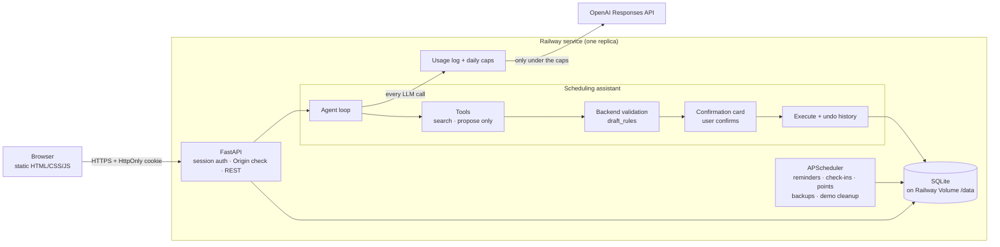

# Schreduler

**A scheduling app that helps you keep your plans, not just record them — tell it what you want in plain language, and an AI assistant drafts the change for you to confirm.**

> 🚧 **Early prototype.** This is a work-in-progress prototype of a larger scheduling app I'm building; features are incomplete and may change.

**Live demo: <https://schreduler.up.railway.app>** — press **Try the demo** on the sign-in screen. No sign-up needed: you get a throwaway account with a sample student week, deleted after 24 hours.


한국어: [README.ko.md](README.ko.md) · Design docs (Korean): [planning](docs/기획보고서.md) · [assistant design & evaluation](docs/assistant_design.md) · [API overview](docs/api_overview.md)

## Engineering highlights

**From slot filling to a tool-using agent.** The first version filled fixed slots from the LLM's output and patched gaps with hand-written rules (`event_parse_service`, 1,093 lines); every bug — "every other week" ignored, locations that couldn't be edited, "11:00–1:00" read as 11 a.m. to 1 a.m. — came from bolting on another slot. Now the LLM only *proposes*: its tools can search and draft but never write, the backend validates and normalizes every draft with the same pure rules module (`draft_rules.py`), the user confirms a card (the model can't approve a proposal it made in the same turn), and every executed change is recorded so it can be undone. Removing the old path took the LLM client from 1,281 to 644 lines.

**Picking the model and reasoning effort with an evaluation set.** Instead of guessing, real requests that had failed before became an evaluation set (`tests/assistant_eval/cases.yaml`) run against the real API. The bar: ≥ 90 % overall and 100 % on the categories that hurt most when wrong (every-other-week, a.m./p.m., deadlines, confirmation safety), then the cheapest per turn. First round, 30 cases, one run each:

| Model | Effort | Passed | Meets the bar | Cost / 1,000 turns | Avg latency |
|---|---|---|---|---|---|
| **gpt-5.6-luna** | **medium** | **29/30 (97 %)** | **yes** | **$0.62** | 3.8 s |
| gpt-5.6-luna | low | 28/30 (93 %) | no (a.m./p.m. 4/5) | $0.55 | 3.5 s |
| gpt-5.4-nano | low | 27/30 (90 %) | yes | $0.88 | 3.0 s |
| gpt-5.4-nano | medium | 29/30 (97 %) | yes | $1.10 | 4.0 s |
| gpt-5.4-mini | low | 26/30 (87 %) | no | $2.54 | 2.8 s |
| gpt-5.4-mini | medium | 27/30 (90 %) | no | $3.13 | 3.7 s |
| gpt-5-nano | low | 21/30 (70 %) | no | $0.43 | 5.4 s |
| gpt-5-nano | medium | 25/30 (83 %) | no | $1.43 | 18.0 s |

The two cheapest that passed were re-run twice more: each met the bar in 2 of 3 runs, and luna/medium stayed cheaper ($0.49–0.62 vs $0.86–0.90 per 1,000 turns) — the smallest model was not the cheapest per turn. After later prompt fixes the set grew to 38 cases; luna/medium passed 37/38 and 36/38, meeting the bar both times ($0.69 and $0.51 per 1,000 turns). Raw reports: [`tests/assistant_eval/results/`](tests/assistant_eval/results/).

**Old vs. new: same cost, fewer dead ends.** Ten requests (8 creates, 2 edits) were run through both paths until one event was confirmed, both on gpt-5.6-luna ([report](tests/assistant_eval/results/compare_nl_paths_20260930-190127.json)). The agent confirmed 10/10, all correct, in 1.0 turn on average; the slot-filling path confirmed 8/10 (1.7 turns on average), stopping twice on an unexpected question about importance. On the 8 both finished, cost was effectively equal — $0.74 vs $0.75 per 1,000 — because the agent's extra calls (2.2 vs 1.4, about 3× the uncached input) were offset by the old path's longer JSON and reasoning output (about 1.8×).

**LLM cost guardrails.** Every LLM request runs inside a usage scope that checks today's spend right before the HTTP call and logs tokens and cost right after; a call outside a scope raises, so a new call site can't skip logging or the caps. Caps are per user ($1.00/day), app-wide ($5.00/day), per demo account ($0.05/day) and all demos together ($2.00/day), counted in two separate pools so the public demo can never use up the owner's budget. Over a cap only the LLM call gets a 429 with a localized message — calendar, tasks, confirm and undo keep working — and the deploy guide adds an OpenAI project spend limit as the outer layer.

**Auth and isolation, tested rather than assumed.** Passwords are hashed with argon2; sessions live on the server and only the SHA-256 of the HttpOnly cookie is stored. One test signs in as user A and tries to read, change, delete and undo every kind of user B's resource, expecting 404 and B's rows untouched; another calls every GET endpoint with data behind it and fails on any INSERT/UPDATE/DELETE, because a `SameSite=Lax` cookie still rides along on a top-level GET from another site (`GET /assistant/sessions/current` used to mark expired proposals; this test keeps that from coming back). Writes from another Origin are refused (CSRF), and the demo cleanup test snapshots every table to prove only expired demo rows disappear.

**Problems caught while deploying.**
- *Scheduler in UTC:* APScheduler defaults to the container's clock (UTC), so the "midnight" points job and the 9 p.m. check-in would have fired hours off; the scheduler now runs in `APP_TIMEZONE` and the deploy guide shows how to print the next fire time.
- *Volume permissions:* a Railway volume mounts root-owned, which breaks a non-root image. The container starts as root only to create and `chown` `/data`, then drops to uid 1000 with `setpriv` — no need to run the whole app as root.
- *Client IP behind the proxy:* every request arrives from the proxy, so a per-IP sign-in lockout would let one person lock everyone out, and whether the edge strips a forged `X-Forwarded-For` isn't documented. Lockout counts per email unless `TRUST_PROXY_HEADERS` is turned on after a manual check, and the demo's creation limit is global for the same reason.

## Architecture



## Features

| Feature | What it does |
|---|---|
| **Natural-language assistant** | Add, change or delete events and repeat periods by just saying it ("ECE360 Lab every other Tuesday 9–12", "move today's quiz from 5 to 6"). An LLM agent looks up existing events with tools and fills in missing details with sensible guesses, marked as *guessed* on the card. |
| **Confirmation cards & undo** | Every change arrives as a card showing what will happen, how many occurrences it touches, and warnings (crosses midnight, already past, a similar event exists, …). It's saved only when you press **Create** or reply "ok", and every saved change can be undone. Changing one occurrence of a repeating event detaches just that occurrence. |
| **Weekly calendar** | A week view (day view on phones) with importance colors, deadlines pinned on top, completion and deletion right from the event popover. |
| **Deadlines & tasks** | Deadline-type events double as a to-do list: due-date reminders, overdue markers, mark as done. |
| **Travel time** | Give an event a location and a travel block is added in front of it automatically. |
| **Points & streaks** | Completed events earn their importance in points; finishing every event several days in a row multiplies them (3 days ×1.1, 7 days ×1.25, 14 days ×1.5). |
| **Persona check-ins** | Pick a character and have an evening check-in about the day. Missed events come up first; if you log why you missed something, the persona replies in its own voice. |
| **Daily AI budget** | Every LLM call is logged with its tokens and cost. Per-user and app-wide daily caps (reset at midnight in `APP_TIMEZONE`) stop LLM calls with HTTP 429; everything that doesn't need the LLM keeps working. The web UI shows "Today's AI usage $0.12 / $1.00" under the chat inputs. |
| **One-click demo** | With `DEMO_MODE_ENABLED`, visitors start a throwaway account seeded with a student week (lectures, a biweekly lab, deadlines, past completions so points and a streak show). Separate LLM caps, no reminders, deleted with all its data after 24 hours. |
| **Korean / English** | The web UI starts in English with an **Eng \| Kor** switch. Notifications, cards and labels follow the screen language; chat replies follow the language of your last message. |

## Roadmap

- **Mobile app** talking to the same REST API, so reminders reach you where the plan happens.
- **Push notifications** for start, end and deadline reminders — the scheduling and FCM sending already exist; device-token registration is the missing piece.
- **Long-term memory for personas**, so the evening check-in remembers patterns across weeks (MemMachine is being considered).
- **Per-user time zones** instead of one `APP_TIMEZONE` per server.
- **Undo by chat** ("undo that") and password reset by email.

## Tech stack

Python 3.12+ · FastAPI · SQLAlchemy 2.x · Alembic · SQLite (dev) / PostgreSQL · APScheduler · OpenAI Responses & Chat Completions APIs · Firebase Cloud Messaging · Telegram Bot API · pytest · Playwright (UI smoke test) · plain HTML/CSS/JS front end (no build step) · Railway

## Quick start

```bash
python -m venv .venv
source .venv/bin/activate              # Windows: .venv\Scripts\activate
pip install -r requirements.txt

cp .env.example .env                   # then fill in values; LLM_API_KEY is needed for the assistant and personas

alembic upgrade head                   # create / migrate the database (default: ./schreduler.db)
python -m app.scripts.seed_personas    # load the default personas (app/scripts/personas_seed_data.json)

uvicorn app.main:app --reload
```

Then open:

- Web app: <http://localhost:8000/app/> — sign up with the `INVITE_CODE` from your `.env` (or set `SIGNUP_MODE=open` locally), or set `DEMO_MODE_ENABLED=true` and press **Try the demo**
- Swagger UI: <http://localhost:8000/docs>
- Health check: <http://localhost:8000/health> (status, version and whether the demo is on)

The web app is served by the same FastAPI process from `frontend/`, so there is nothing to build and no CORS to configure.

### Docker

```bash
docker compose up --build                                                        # SQLite, stored in a named volume
docker compose -f docker-compose.yml -f docker-compose.postgres.yml up --build    # PostgreSQL
```

The container prepares the data folder, runs `alembic upgrade head` (and does not start the server if that fails), then serves on `$PORT` (default 8000) with a single uvicorn worker.

### Deploying (Railway)

See [`docs/deploy_railway.md`](docs/deploy_railway.md) (Korean): one service from the `Dockerfile`, a volume at `/data` for SQLite, daily backups, environment variables, first admin, demo mode, logs and rollback.

> **Keep exactly one replica.** Reminders, the evening check-in, midnight points, backups and the demo cleanup are scheduled inside the server process; two processes would run everything twice. Use `RUN_SCHEDULER=false` for any extra process.

### Demo mode

To let visitors try the app while sign-up stays closed, keep `SIGNUP_MODE=closed` and set `DEMO_MODE_ENABLED=true`. **Try the demo** then calls `POST /auth/demo`, which creates an account with no email or password, seeds it, and signs it in for 24 hours (the same browser comes back to it until then). An hourly job deletes expired demo accounts and everything they own; their LLM usage rows are kept without the user id so the day's totals stay accurate. Demo accounts skip reminders and the midnight points job, can't manage personas or set a password, and at most `DEMO_MAX_CREATIONS_PER_HOUR` can be started per hour.

## Configuration

Settings come from environment variables or a `.env` file. [`.env.example`](.env.example) documents each one; never commit `.env`.

| Variable | Default | Description |
|---|---|---|
| `DATABASE_URL` | `sqlite:///./schreduler.db` | SQLAlchemy URL. For PostgreSQL: `postgresql+psycopg://user:pw@host:5432/db` |
| `LLM_API_KEY` | *(none)* | OpenAI API key. Without it, LLM endpoints return 500 |
| `LLM_MODEL` | `gpt-5.6-luna` | Model for persona chat, check-ins and missed-event feedback |
| `ASSISTANT_MODEL` | `gpt-5.6-luna` | Model for the scheduling assistant (Responses API) |
| `ASSISTANT_REASONING_EFFORT` | `medium` | `reasoning.effort` for the assistant; validated per model at startup |
| `LLM_DAILY_BUDGET_PER_USER_USD` | `1.00` | Daily LLM spend cap per user (USD), reset at `APP_TIMEZONE` midnight |
| `LLM_DAILY_BUDGET_TOTAL_USD` | `5.00` | Daily LLM spend cap for all users and scripts together (demo accounts are counted separately) |
| `LLM_DAILY_BUDGET_ADMIN_USD` | *(none)* | Cap for users with `is_admin`; without it, admins get the per-user cap |
| `DEMO_MODE_ENABLED` | `false` | Show [Try the demo] and open `POST /auth/demo`: a throwaway account with a sample week, deleted after 24 hours. Independent of `SIGNUP_MODE` |
| `DEMO_MAX_CREATIONS_PER_HOUR` | `30` | Demo accounts that can be started in any hour, across everyone (not per IP — behind a proxy the IP can't be trusted) |
| `DEMO_LLM_BUDGET_PER_USER_USD` | `0.05` | Daily LLM cap per demo account |
| `DEMO_LLM_BUDGET_TOTAL_USD` | `2.00` | Daily LLM cap for all demo accounts together, counted apart from `LLM_DAILY_BUDGET_TOTAL_USD` |
| `APP_TIMEZONE` | `America/Toronto` | IANA time zone used for "today", weekdays and reminders |
| `SIGNUP_MODE` | `invite` | `closed` (no sign-ups), `invite` (needs `INVITE_CODE`) or `open` |
| `INVITE_CODE` | *(none)* | Code new users must enter when `SIGNUP_MODE=invite`. Without it nobody can sign up |
| `SESSION_COOKIE_SECURE` | `false` | Send the session cookie only over HTTPS. Turn on in production |
| `ALLOWED_ORIGINS` | *(same host)* | Comma-separated origins allowed to send POST/PUT/DELETE (e.g. `https://schreduler.example.com`). Empty: the request's own host |
| `RUN_SCHEDULER` | `true` | Run reminders, check-ins, midnight points, backups and the demo cleanup in this process. Exactly one process may have it on |
| `TRUST_PROXY_HEADERS` | `false` | Take the client IP from `X-Forwarded-For` / `X-Real-IP` and also lock sign-in per IP. Off: per email only |
| `FORWARDED_ALLOW_IPS` | `127.0.0.1` | Proxies uvicorn trusts for `X-Forwarded-Proto` (`*` on Railway) |
| `FIREBASE_CREDENTIALS_JSON` | *(none)* | Service-account JSON as text, instead of a file path. Wins over `FIREBASE_CREDENTIALS_PATH` |
| `BACKUP_DIR` | *(next to the DB)* | Where the daily SQLite backups go (default `<db folder>/backups`, 14 kept) |
| `FIREBASE_CREDENTIALS_PATH` | *(none)* | Path to an FCM service-account JSON. Without it, push notifications are only logged |
| `TELEGRAM_BOT_TOKEN` | *(none)* | Bot token for escalation messages. Without it, they are only logged |
| `LOG_LEVEL` | `INFO` | Application log level |
| `ENVIRONMENT` | `development` | Environment name |

Docker only: `DOCKER_DATABASE_URL` (database URL inside the container, used instead of `DATABASE_URL`), `DOCKER_FIREBASE_CREDENTIALS_PATH`, `API_PORT` (default `8000`), and `POSTGRES_USER` / `POSTGRES_PASSWORD` / `POSTGRES_DB` (all default to `schreduler`, for development).

## Tests and evaluation

```bash
python -m pytest                         # everything under tests/ (also runs the JS tests if Node is installed)
python -m pytest --cov=app               # with coverage
node --test tests/frontend/*.test.mjs    # front-end unit tests only
python -m app.scripts.smoke_ui           # real browser: log in, every tab, About, the demo; no console errors allowed
```

Tests use in-memory SQLite and scripted fake LLM responses, so they never call a real API.

The assistant also has an evaluation set of real-world requests (`tests/assistant_eval/cases.yaml`). It calls the real API, so it costs money and is kept out of pytest:

```bash
python -m app.scripts.eval_assistant --effort medium
python -m app.scripts.eval_assistant --summarize "tests/assistant_eval/results/*.json"   # compare saved runs
```

Each run prints pass rates by category, LLM calls, tokens, latency and cost per turn, and saves a JSON report to `tests/assistant_eval/results/`.

Other scripts:

| Command | Purpose |
|---|---|
| `python -m app.scripts.export_postman` | Regenerate the Postman collection from the OpenAPI spec (run after API changes) |
| `python -m app.scripts.create_admin --email you@example.com` | Attach an email and password to existing user 1 and make it an admin (`--user-id N` for another user). The password is typed in the terminal, never passed as an argument |
| `python -m app.scripts.create_admin --email you@example.com --reset` | Set a new password for that account and sign it out everywhere |
| `python -m app.scripts.create_admin --email you@example.com --new` | On an empty database (a fresh deployment), create the first admin account |
| `python -m app.scripts.backup_db` | Back up the SQLite database now (consistent copy via the sqlite3 backup API) |
| `python -m app.scripts.smoke_ui` | Open the web UI in an installed Chrome (Playwright, `pip install -r requirements-dev.txt`) on a throwaway database: log in, every tab, the prototype notice and About dialog, log out, then the demo path; fails on any console error or failed request. `--base-url https://…` with `SMOKE_EMAIL`/`SMOKE_PASSWORD` checks a deployment (add `--with-demo` to try the demo there too). Run it after every front-end change |
| `python -m app.scripts.compare_prompt_cache --task daily_checkin --repeat 5` | Compare input tokens with and without prompt caching (real API calls) |
| `python -m app.scripts.usage_report --days 7` | LLM cost table by day, user and feature (from `llm_usage_logs`) |

## Project structure

```
app/
├── main.py              # FastAPI app: routers, exception handlers, scheduled jobs
├── frontend_serving.py  # serves frontend/ with cache-busting asset URLs
├── api/                 # routers (endpoints)
├── models/              # SQLAlchemy models
├── schemas/             # Pydantic request/response schemas
├── services/
│   ├── assistant/       # tool-using scheduling assistant: agent loop, tools, drafts, prompt, execution
│   ├── draft_rules.py   # shared validation and normalization for drafts (RRULEs, previews, time strings)
│   ├── llm_client.py    # Responses and Chat Completions clients, prompt caching, usage logging
│   ├── llm_usage.py     # per-call usage log and the daily budget check (regular and demo pools)
│   ├── llm_pricing.py   # per-model token prices (shared with the evaluation script)
│   ├── demo_service.py  # demo accounts: creation limit, sign-in, hourly cleanup
│   ├── demo_seed.py     # the sample student week, dated relative to today
│   └── …                # events, ranges, undo history, notifications, points, check-ins
├── child_events/        # travel-time and prep sub-events
├── core/                # settings, DB, scheduler, auth, errors, clock, version, OpenAPI metadata
├── i18n/                # Korean/English messages, notifications, category labels
└── scripts/             # seeding, evaluation, Postman export, UI smoke test
frontend/                # static web client (HTML/CSS/JS, en/ko dictionaries in i18n.js)
alembic/                 # database migrations
tests/                   # pytest and Node tests, assistant evaluation set
docs/                    # design docs, API overview, Postman collection, media
```

## Known limitations

- **It's a prototype.** Features and data formats may still change, and the web version doesn't send notifications yet.
- **Sign-in is email and password only.** Sessions are HttpOnly cookies kept on the server for 30 days. There is no password reset by email yet — an admin resets it with `create_admin --reset`.
- **No device-token registration.** Without an FCM token endpoint, push notifications are logged rather than delivered.
- **One time zone per server.** Everything follows `APP_TIMEZONE`; per-user time zones aren't supported yet.
- **Reminder jobs live in memory.** They are re-registered from the database on startup, but a single worker is required.
- **Demo data is temporary.** Demo accounts and everything in them are deleted 24 hours after they're created.
- **The assistant is probabilistic.** It is evaluated against a fixed set of requests (above 90 % in recent runs with the default model) and every change needs confirmation, but it can still misread a request.

## License

[MIT](LICENSE) © 2026 Junseo Kim
